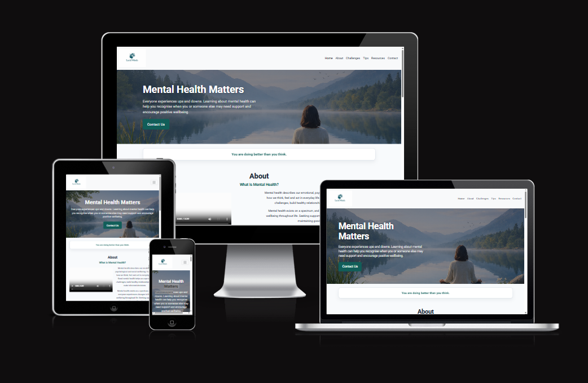
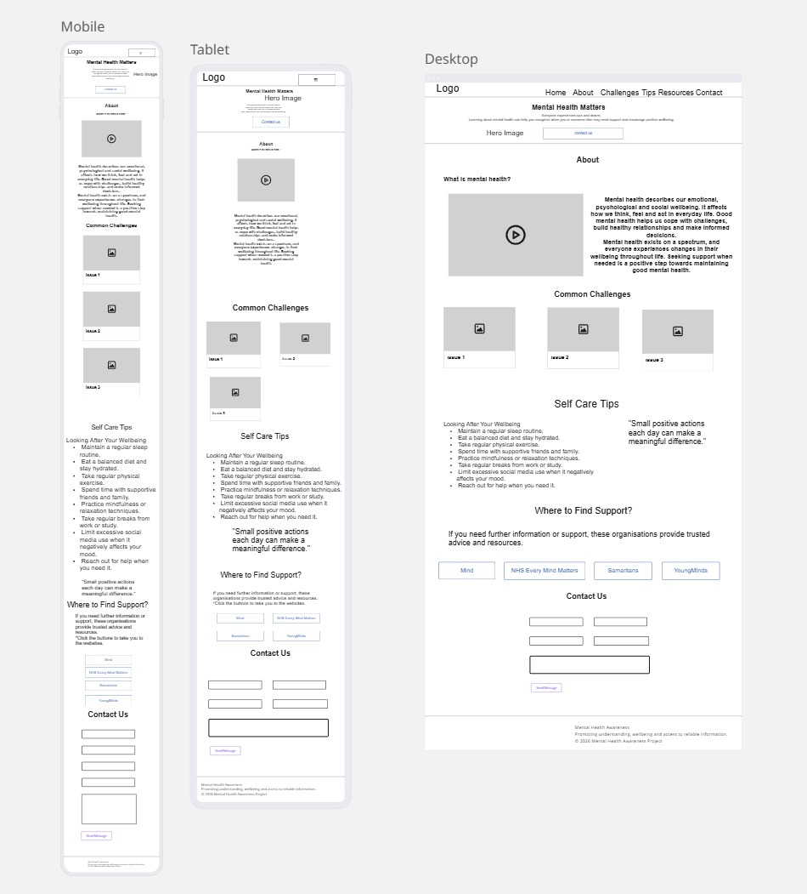
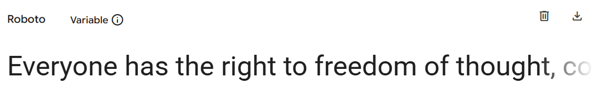
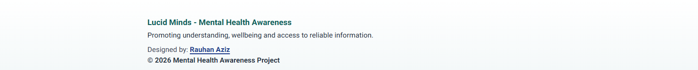
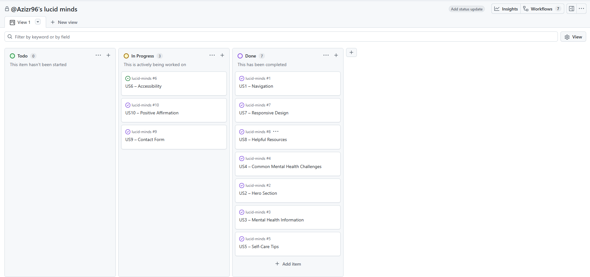

# Portfolio Individual Project 1 - Lucid Minds: Mental Health Awareness Website

This website was developed as part of Code Institute's first individual assessment project. It aims to provide a welcoming and supportive platform where users can explore mental health topics, access valuable resources, and discover practical tools to help manage everyday challenges and improve their overall well-being.

Live Link: 

---

## Description

Lucid Minds is a fully responsive, single-page website built with HTML, CSS, and the Bootstrap framework. It was created as part of Code Institute's first individual assessment to demonstrate responsive web design, semantic HTML, and modern CSS techniques.
As a visitor, I want to provide feedback so that I can suggest improvements to the webpage. A confirmation message should show once I have provided feedback.
The website provides accessible, beginner-friendly information on common mental health topics, including stress, anxiety and low mood. It also offers practical wellness tips and signposts users to trusted external support resources.

Designed with a clean, calming interface and a mobile-first approach, Lucid Minds delivers a consistent and user-friendly experience across desktop, tablet, and mobile devices.

---

## UX (User Experience)

### User Stories

*Must Have* 

These are essential:

**US1 – Navigation**

User Story

As a visitor, I want a clear navigation menu so that I can quickly access different sections of the webpage.

Acceptance Criteria

- Navigation is visible at the top of the page. 
- Navigation links scroll to the correct section. 
- Navigation works on desktop and mobile devices. 

Tasks

- Create Bootstrap navbar. 
- Add section anchor links. 
- Test all navigation links. 
- Ensure responsive behaviour. 

**US2 – Hero Section**

User Story

As a first-time visitor, I want an engaging introduction so that I immediately understand the purpose of the website.

Acceptance Criteria

- Hero section contains a clear heading. 
- Hero contains a short supporting paragraph. 
- Call-to-action button scrolls to the About section. 
- Background and text meet accessibility standards. 

Tasks

- Create hero section. 
- Add headline. 
- Add introductory text. 
- Style CTA button. 
- Apply accessible colours. 

**US3 – Mental Health Information**

User Story

As a visitor, I want easy-to-understand information about mental health so that I can develop a basic understanding of the topic.

Acceptance Criteria

- About section explains mental health. 
- Information is concise. 
- Content uses semantic headings. 
- Text is easy to read. 

Tasks

- Write About content. 
- Add heading. 
- Format paragraphs. 
- Apply spacing. 

**US4 – Common Mental Health Challenges**

User Story

As a visitor, I want information about common mental health challenges so that I can recognise some common experiences.

Acceptance Criteria

- Three information cards are displayed. 
- Each card contains a heading. 
- Each card includes a short explanation. 
- Cards stack correctly on mobile devices. 

Tasks

- Create Bootstrap cards. 
- Add content. 
- Make responsive. 
- Style consistently. 

**US5 – Self-Care Tips**

User Story

As a visitor, I want practical wellbeing tips so that I can learn simple ways to support my mental health.

Acceptance Criteria

- Tips are presented as a clear list. 
- Information is easy to scan. 
- List remains readable on smaller screens. 

Tasks

- Create list group. 
- Add self-care tips. 
- Apply spacing. 
- Test responsiveness. 

**US6 – Accessibility**

User Story

As a user, I want the website to be accessible so that I can easily read and navigate the content.

Acceptance Criteria

- Colour contrast meets WCAG AAA standards. 
- Images include alternative text. 
- Semantic HTML is used. 
- Keyboard navigation functions correctly. 

Tasks

- Check colour contrast. 
- Add alt text. 
- Validate heading order. 
- Test keyboard navigation. 

**US7 – Responsive Design**

User Story

As a visitor using different devices, I want the website to display correctly on any screen size.

Acceptance Criteria

- Layout adapts to mobile, tablet and desktop. 
- Navigation remains usable. 
- Images resize correctly. 
- No horizontal scrolling occurs. 

Tasks

- Apply Bootstrap grid. 
- Test breakpoints. 
- Adjust spacing. 
- Optimise images. 

*Should Have*

These improve the user experience but are not essential.

**US8 – Helpful Resources**

User Story

As a visitor, I want links to trusted organisations so that I can access further support if needed.

Acceptance Criteria

- Resource section contains trusted organisations. 
- Links open in a new tab. 
- Buttons are clearly labelled. 

Tasks

- Add resource buttons. 
- Link to official websites. 
- Test links. 

**US9 – Contact Form**

User Story

As a visitor, I want to provide feedback so that I can suggest improvements to the webpage. A confirmation message should show once I have provided feedback.

Acceptance Criteria

- Form includes Name, Email and Message. 
- Submit button is visible. 
- Form layout is responsive. 
- A confirmation message should appear when the form is submitted.

Tasks

- Build Bootstrap form. 
- Add labels. 
- Style form. 
- Test responsiveness.
- Add a modal success message pop-up. 

*Could Have* 

Optional features if time allows.

**US10 – Positive Affirmation**

User Story

As a visitor, I want to read an encouraging message so that I leave the website feeling supported.

Acceptance Criteria

- Affirmation section contains positive messaging. 
- Section uses calming colours. 
- Text is centred and easy to read. 

Tasks

- Create affirmation section. 
- Add quotation. 
- Style background. 

---

### Strategy Plane

**Project Goal**

The primary goal of Lucid Minds is to provide an accessible, informative, and welcoming introduction to mental health. The website is designed to increase awareness of common mental health challenges, promote positive wellbeing, and direct users to trusted external support services.

As this project was developed for Code Institute's first individual assessment, it also demonstrates the ability to create a fully responsive, accessible website using HTML, CSS, Bootstrap, and user-centred design principles.

**Target Audience**

The website is intended for:

- Individuals with little or no prior knowledge of mental health
- People looking for simple self-care advice
- Visitors seeking reliable signposting to trusted organisations
- Users accessing the website from desktop, tablet, or mobile devices

**User Needs**

Users should be able to:

- understand the purpose of the website immediately
- navigate easily between sections
- learn basic mental health information
- recognise common mental health challenges
- discover practical wellbeing tips
- access trusted support organisations
- provide feedback through a simple contact form
- use the website regardless of device or accessibility needs

**Business Goals**

Although this is not a commercial website, the project aims to:

- demonstrate responsive web development skills
- showcase semantic HTML and Bootstrap
- meet WCAG AAA accessibility principles where practical
- satisfy the assessment criteria for Code Institute

### Scope Plane

**Functional Requirements**

The website includes:

- Responsive Bootstrap navigation bar
- Hero section with call-to-action button
- Smooth scrolling navigation
- About Mental Health section
- Bootstrap cards describing common mental health challenges
- Self-care tips displayed using a Bootstrap List Group
- External links to trusted mental health organisations
- Responsive contact form
- Footer with project information
- Fully responsive layout across mobile, tablet, and desktop
- Semantic HTML
- Keyboard-accessible navigation
- Images with descriptive alternative text

*Content Requirements*

The website contains the following sections:

1. Navigation
2. Hero
3. About Mental Health
4. Common Mental Health Challenges
5. Self-Care Tips
6. Helpful Resources
7. Contact Form
8. Footer

**Features Excluded**

The following were considered outside the project's scope:

- User accounts
- Login functionality
- Database integration
- Live chat
- Appointment booking
- Medical advice
- Backend functionality

These features were intentionally excluded to keep the project focused on providing accessible educational content.

### Structure Plane

**Information Architecture**
Home
│
├── Hero
│
├── Affirmations
│
├── About Mental Health
│
├── Common Mental Health Challenges
│
├── Self-Care Tips
│
├── Positive Affirmation
│
├── Helpful Resources
│
├── Contact
│
└── Footer

The website follows a clear top-to-bottom flow that introduces users to increasingly detailed information before providing external support and an opportunity to submit feedback.

**User Flow**

1. User lands on Hero section.
2. User immediately understands the purpose of the website.
3. CTA button encourages contacting us.
4. User learns about mental health.
5. User recognises common mental health challenges.
6. User discovers practical wellbeing strategies.
7. User accesses trusted external organisations if further support is required.
8. User optionally submits feedback.

## Skeleton Plane

**Wireframes*

**Navigation**

The navigation bar remains fixed at the top of the page, allowing users to quickly access each section using anchor links.

**Accessibility**

To improve usability, the interface includes:

- logical heading hierarchy (h1–h3)
- semantic HTML elements (header, main, section, footer)
- keyboard-accessible navigation
- descriptive button labels
- descriptive image alternative text
- sufficient whitespace
- large clickable buttons
- responsive layouts using Bootstrap's grid system
- high colour contrast aligned with WCAG AAA principles where practical

## Surface Plane / Design

**Colour Palette**

The palette was selected to promote feelings of trust, calmness, and clarity while maintaining strong colour contrast.

**Imagery**

Images and icons are used sparingly to support content without distracting from it. Decorative imagery reinforces the theme of wellbeing, while all meaningful images include descriptive alternative text.

**Typography**

Google fonts 'Roboto font' used for clear readable and accessible features

**Layout**

Bootstrap's responsive grid system ensures that content adapts seamlessly across desktop, tablet, and mobile devices. Cards stack vertically on smaller screens, buttons remain touch-friendly, and spacing scales appropriately to maintain a consistent user experience.

**Visual Style**

The interface adopts a minimalist design with:

- generous whitespace
- rounded cards and buttons
- subtle shadows
- consistent spacing
- calming accent colours
- clear visual hierarchy
- limited animations to reduce cognitive load

This approach helps create an accessible, supportive environment that aligns with the website's purpose of promoting mental health awareness and wellbeing.

--- 
## Contents

| Content | Screenshot |
| ----------- | ----------- |
| Navbar |  |
| Hero with CTA |  |
| Affirmations |  |
| About |  |
| Challenges in mental health |  |
| Tips for better mental health |  |
| Resources for organisations |  |
| Contact form |  |
| Footer copyright |  |

---
## Website Features

Lucid Minds includes the following features to provide an accessible and informative user experience:

- Responsive Navigation Bar – A Bootstrap navigation bar with anchor links allows users to quickly navigate to each section of the webpage on desktop and mobile devices.

- Hero Section – Introduces the purpose of the website with a clear heading, supporting text, and a call-to-action button that smoothly scrolls to the About section.

- Positive Affirmation – Includes an encouraging message designed to leave visitors with a positive reminder about looking after their mental health.

- About Mental Health – Provides a concise explanation of mental health and its importance using semantic HTML for improved accessibility.

- Common Mental Health Challenges – Displays information about stress, anxiety, and low mood using responsive Bootstrap cards that adapt to different screen sizes.

- Self-Care Tips – Presents practical wellbeing advice in an easy-to-read Bootstrap list group, helping users identify simple habits that support mental wellbeing.

- Helpful Resources – Signposts users to trusted organisations through clearly labelled external links that open in a new browser tab.

- Contact Form – Provides a responsive feedback form where visitors can submit suggestions for improving the website.

- Accessibility – Built using semantic HTML, descriptive alternative text, keyboard-friendly navigation, and a colour palette chosen to provide strong colour contrast and improve readability. Animations have option to be reduced to ensure accessible experience.

- Responsive Design – Developed with Bootstrap's grid system to ensure a consistent experience across desktop, tablet, and mobile devices.
---
## Tablet/Mobile View

---
## Future Features

Due to the scope and time constraints of the Code Institute assessment, several potential features were identified but were not included in the initial release of Lucid Minds. These enhancements would further improve the user experience, accessibility, and functionality of the website in future iterations.

Future improvements planned for Lucid Minds include:

- Add a dark mode option to improve accessibility and provide users with a choice of viewing preferences.

- Include expandable information sections to provide more detailed guidance on additional mental health topics without overwhelming users.

- Implement form validation and backend functionality so feedback can be submitted and stored securely.

- Add a search feature to help users quickly find relevant content and resources.

- Introduce downloadable wellbeing resources, such as self-care checklists and printable guides.

- Expand the Resources section with additional trusted organisations and crisis support services.

- Add subtle animations and interactive elements to improve engagement while maintaining accessibility.

- Provide support for multiple languages to make the website accessible to a wider audience.

---
## Tools & Technologies

| Tool / Tech | Use |
| --- | --- |
|  | Generate README and TESTING templates. |
|  | Version control. (`git add`, `git commit`, `git push`) |
|  | Secure online code storage. |
|  | Local IDE for development. |
|  | Main site content and layout. |
|  | Design and layout. |
|  | Hosting the deployed front-end site. |
|  | Front-end CSS framework for modern responsiveness and pre-built components. |
|  | Icons. |
|  | Help debug, troubleshoot, and explain things. |

---
## Agile Development Process

### GitHub Projects

[GitHub Projects](https://www.github.com/Azizr96/lucid-minds/projects) served as an Agile tool for this project. Through it, EPICs, User Stories, issues/bugs, and Milestone tasks were planned, then subsequently tracked on a regular basis using the Kanban project board.

### GitHub Issues

[GitHub Issues](https://www.github.com/Azizr96/lucid-minds/issues) served as another Agile tool. There, I managed my user stories and milestone tasks and tracked any issues or bugs.

| Link | Screenshot |
| --- | --- |
|  |  |
|  |  |

### MoSCoW Prioritization

I've decomposed my epics into user stories for prioritising and implementing them. Using this approach, I was able to apply "MoSCoW" prioritisation and labels to my user stories within the Issues tab.

- **Must Have**: guaranteed to be delivered - required to Pass the project (*max ~60% of stories*)
- **Should Have**: adds significant value, but not vital (*~20% of stories*)
- **Could Have**: has small impact if left out (*the rest ~20% of stories*)

---
## Deployment

### GitHub Pages

The site was deployed to GitHub Pages. The steps to deploy are as follows:

- In the [GitHub repository](https://www.github.com/Azizr96/lucid-minds), navigate to the "Settings" tab.
- In Settings, click on the "Pages" link from the menu on the left.
- From the "Build and deployment" section, click the drop-down called "Branch", and select the **main** branch, then click "Save".
- The page will be automatically refreshed with a detailed message display to indicate the successful deployment.
- Allow up to 5 minutes for the site to fully deploy.

The live link can be found on [GitHub Pages](https://azizr96.github.io/lucid-minds).

### Local Development

This project can be cloned or forked in order to make a local copy on your own system.

#### Cloning

You can clone the repository by following these steps:

1. Go to the [GitHub repository](https://www.github.com/Azizr96/lucid-minds).
2. Locate and click on the green "Code" button at the very top, above the commits and files.
3. Select whether you prefer to clone using "HTTPS", "SSH", or "GitHub CLI", and click the "copy" button to copy the URL to your clipboard.
4. Open "Git Bash" or "Terminal".
5. Change the current working directory to the location where you want the cloned directory.
6. In your IDE Terminal, type the following command to clone the repository:
	- `git clone https://www.github.com/Azizr96/lucid-minds.git`
7. Press "Enter" to create your local clone.

Alternatively, if using Ona (formerly Gitpod), you can click below to create your own workspace using this repository.

**Please Note**: in order to directly open the project in Ona (Gitpod), you should have the browser extension installed. A tutorial on how to do that can be found [here](https://www.gitpod.io/docs/configure/user-settings/browser-extension).

#### Forking

By forking the GitHub Repository, you make a copy of the original repository on our GitHub account to view and/or make changes without affecting the original owner's repository. You can fork this repository by using the following steps:

1. Log in to GitHub and locate the [GitHub Repository](https://www.github.com/Azizr96/lucid-minds).
2. At the top of the Repository, just below the "Settings" button on the menu, locate and click the "Fork" Button.
3. Once clicked, you should now have a copy of the original repository in your own GitHub account!

---
## Testing
> [!NOTE]  
> For all testing, please refer to the [TESTING.md](TESTING.md) file.
---
## Credits & Attributions

### Content
- [Markdown Builder](https://markdown.2bn.dev)  Help generating Markdown files 

### Media

- All images were generated with Micorsoft Co-pilot
- video was obtained from [Maudsley learning](https://maudsleylearning.com/) on what is mental health.
- Images were resized and converted from png to webP using [Squoosh.app](https://squoosh.app/editor)

### Frameworks, Icons and Fonts

- Bootstrap framework were used throughout the project
- Font Awesome icons were implemented
- Google Fonts were imported into the project

### Acknowledgements

- I would like to thank Tim at Code Institute, [Tim Nelson](https://www.github.com/TravelTimN) for valuable advice on developing the project and providing the markdown builder web app.
