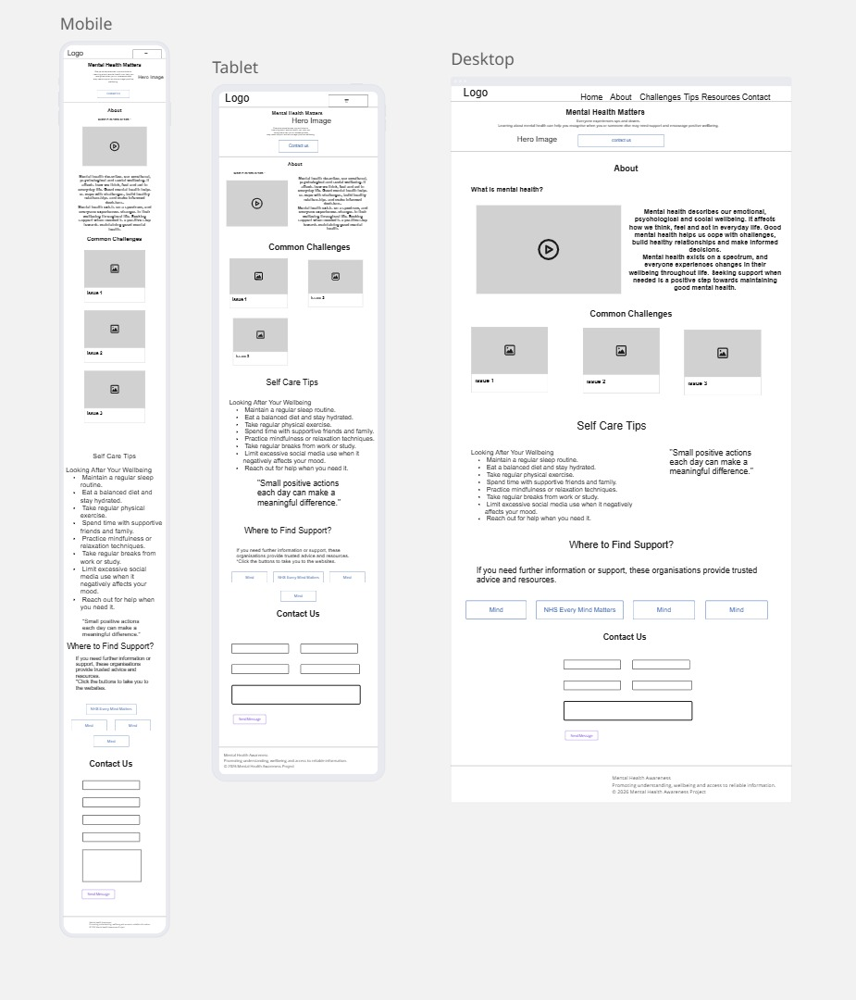

# Portfolio Individual Project 1 - Lucid Minds: Mental Health Awareness Website

This website was developed as part of Code Institute's first individual assessment project. It aims to provide a welcoming and supportive platform where users can explore mental health topics, access valuable resources, and discover practical tools to help manage everyday challenges and improve their overall well-being.

Live Link: [Lucid Minds - Mental Health Awareness]

---

## Description

Lucid Minds is a fully responsive, single-page website built with HTML, CSS, and the Bootstrap framework. It was created as part of Code Institute's first individual assessment to demonstrate responsive web design, semantic HTML, and modern CSS techniques.

The website provides accessible, beginner-friendly information on common mental health topics, including stress, anxiety and low mood. It also offers practical wellness tips and signposts users to trusted external support resources.

Designed with a clean, calming interface and a mobile-first approach, Lucid Minds delivers a consistent and user-friendly experience across desktop, tablet, and mobile devices.

---

## UX (User Experience)

### User Stories

Must Have 
These are essential:

**US1 – Navigation**

User Story

As a visitor, I want a clear navigation menu so that I can quickly access different sections of the webpage.

Acceptance Criteria

- Navigation is visible at the top of the page. 
- Navigation links scroll to the correct section. 
- Navigation works on desktop and mobile devices. 

Tasks

- Create Bootstrap navbar. 
- Add section anchor links. 
- Test all navigation links. 
- Ensure responsive behaviour. 

**US2 – Hero Section**

User Story

As a first-time visitor, I want an engaging introduction so that I immediately understand the purpose of the website.

Acceptance Criteria

- Hero section contains a clear heading. 
- Hero contains a short supporting paragraph. 
- Call-to-action button scrolls to the About section. 
- Background and text meet accessibility standards. 

Tasks

- Create hero section. 
- Add headline. 
- Add introductory text. 
- tyle CTA button. 
- Apply accessible colours. 

**US3 – Mental Health Information**

User Story

As a visitor, I want easy-to-understand information about mental health so that I can develop a basic understanding of the topic.

Acceptance Criteria

- About section explains mental health. 
- Information is concise. 
- Content uses semantic headings. 
- Text is easy to read. 

Tasks

- Write About content. 
- Add heading. 
- Format paragraphs. 
- Apply spacing. 

**US4 – Common Mental Health Challenges**

User Story

As a visitor, I want information about common mental health challenges so that I can recognise some common experiences.

Acceptance Criteria

- Three information cards are displayed. 
- Each card contains a heading. 
- Each card includes a short explanation. 
- Cards stack correctly on mobile devices. 

Tasks

- Create Bootstrap cards. 
- Add content. 
- Make responsive. 
- Style consistently. 

**US5 – Self-Care Tips**

User Story

As a visitor, I want practical wellbeing tips so that I can learn simple ways to support my mental health.

Acceptance Criteria

- Tips are presented as a clear list. 
- Information is easy to scan. 
- List remains readable on smaller screens. 

Tasks

- Create list group. 
- Add self-care tips. 
- Apply spacing. 
- Test responsiveness. 

**US6 – Accessibility**

User Story

As a user, I want the website to be accessible so that I can easily read and navigate the content.

Acceptance Criteria

- Colour contrast meets WCAG AAA standards. 
- Images include alternative text. 
- Semantic HTML is used. 
- Keyboard navigation functions correctly. 

Tasks

- Check colour contrast. 
- Add alt text. 
- Validate heading order. 
- Test keyboard navigation. 

**US7 – Responsive Design**

User Story

As a visitor using different devices, I want the website to display correctly on any screen size.

Acceptance Criteria

- Layout adapts to mobile, tablet and desktop. 
- Navigation remains usable. 
- Images resize correctly. 
- No horizontal scrolling occurs. 

Tasks

- Apply Bootstrap grid. 
- Test breakpoints. 
- Adjust spacing. 
- Optimise images. 

Should Have 

These improve the user experience but are not essential.

**US8 – Helpful Resources**

User Story

As a visitor, I want links to trusted organisations so that I can access further support if needed.

Acceptance Criteria

- Resource section contains trusted organisations. 
- Links open in a new tab. 
- Buttons are clearly labelled. 

Tasks

- Add resource buttons. 
- Link to official websites. 
- Test links. 

**US9 – Contact Form**

User Story

As a visitor, I want to provide feedback so that I can suggest improvements to the webpage.

Acceptance Criteria

- Form includes Name, Email and Message. 
- Submit button is visible. 
- Form layout is responsive. 

Tasks

- Build Bootstrap form. 
- Add labels. 
- Style form. 
- Test responsiveness. 

Could Have 

Optional features if time allows.

**US10 – Positive Affirmation**

User Story

As a visitor, I want to read an encouraging message so that I leave the website feeling supported.

Acceptance Criteria

- Affirmation section contains positive messaging. 
- Section uses calming colours. 
- Text is centred and easy to read. 

Tasks

- Create affirmation section. 
- Add quotation. 
- Style background. 

### Strategy Plane

**Project Goal**

The primary goal of Lucid Minds is to provide an accessible, informative, and welcoming introduction to mental health. The website is designed to increase awareness of common mental health challenges, promote positive wellbeing, and direct users to trusted external support services.

As this project was developed for Code Institute's first individual assessment, it also demonstrates the ability to create a fully responsive, accessible website using HTML, CSS, Bootstrap, and user-centred design principles.

**Target Audience**

The website is intended for:

- Individuals with little or no prior knowledge of mental health- 
- People looking for simple self-care advice
- Visitors seeking reliable signposting to trusted organisations
- Users accessing the website from desktop, tablet, or mobile devices

**User Needs**

Users should be able to:

- understand the purpose of the website immediately
- navigate easily between sections
- learn basic mental health information
- recognise common mental health challenges
- discover practical wellbeing tips
- access trusted support organisations
- provide feedback through a simple contact form
- use the website regardless of device or accessibility needs

**Business Goals**

Although this is not a commercial website, the project aims to:

- demonstrate responsive web development skills
- showcase semantic HTML and Bootstrap
- meet WCAG AAA accessibility principles where practical
- satisfy the assessment criteria for Code Institute

### Scope Plane

**Functional Requirements**

The website includes:

- Responsive Bootstrap navigation bar
- Hero section with call-to-action button
- Smooth scrolling navigation
- -About Mental Health section
- Bootstrap cards describing common mental health challenges
- Self-care tips displayed using a Bootstrap List Group
- External links to trusted mental health organisations
- Responsive contact form
- Footer with project information
- Fully responsive layout across mobile, tablet, and desktop
- Semantic HTML
- Keyboard-accessible navigation
- Images with descriptive alternative text

*Content Requirements*

The website contains the following sections:

1. Navigation
2. Hero
3. About Mental Health
4. Common Mental Health Challenges
5. Self-Care Tips
6. Helpful Resources
7. Contact Form
8. Footer

**Features Excluded**

The following were considered outside the project's scope:

- User accounts
- Login functionality
- Database integration
- Live chat
- Appointment booking
- Medical advice
- Backend functionality

These features were intentionally excluded to keep the project focused on providing accessible educational content.

### Structure Plane

**Information Architecture**
Home
│
├── Hero
│
├── About Mental Health
│
├── Common Mental Health Challenges
│
├── Self-Care Tips
│
├── Positive Affirmation
│
├── Helpful Resources
│
├── Contact
│
└── Footer

The website follows a clear top-to-bottom flow that introduces users to increasingly detailed information before providing external support and an opportunity to submit feedback.

**User Flow**

1. User lands on Hero section.
2. User immediately understands the purpose of the website.
3. CTA button encourages contacting us.
4. User learns about mental health.
5. User recognises common mental health challenges.
6. User discovers practical wellbeing strategies.
7. User accesses trusted external organisations if further support is required.
8. User optionally submits feedback.

## Skeleton Plane

**Wireframes*

**Navigation**

The navigation bar remains fixed at the top of the page, allowing users to quickly access each section using anchor links.

**Accessibility**

To improve usability, the interface includes:

- logical heading hierarchy (h1–h3)
- semantic HTML elements (header, main, section, footer)
- keyboard-accessible navigation
- descriptive button labels
- descriptive image alternative text
- sufficient whitespace
- large clickable buttons
- responsive layouts using Bootstrap's grid system
- high colour contrast aligned with WCAG AAA principles where practical

## Surface Plane / Design

**Colour Palette**

The palette was selected to promote feelings of trust, calmness, and clarity while maintaining strong colour contrast.

**Imagery**

Images and icons are used sparingly to support content without distracting from it. Decorative imagery reinforces the theme of wellbeing, while all meaningful images include descriptive alternative text.

**Typography**

Google fonts 'Roboto font' used for clear readable and accessible features

**Layout**

Bootstrap's responsive grid system ensures that content adapts seamlessly across desktop, tablet, and mobile devices. Cards stack vertically on smaller screens, buttons remain touch-friendly, and spacing scales appropriately to maintain a consistent user experience.

**Visual Style**

The interface adopts a minimalist design with:

- generous whitespace
- rounded cards and buttons
- subtle shadows
- consistent spacing
- calming accent colours
- clear visual hierarchy
- limited animations to reduce cognitive load

This approach helps create an accessible, supportive environment that aligns with the website's purpose of promoting mental health awareness and wellbeing.

--- 
## Contents

---
## Website Features

---
## Tablet/Mobile View

---
## Future Features

---
## Technologies Used

 - HTML5
 - CSS3
 - Bootstrap 5
 - Font Awesome
 - Google Fonts
 - GitHub & Git
 - Copilot (image creation & code debugging)
---
## Deployment

---
## Testing

---
## Credits & Attributions

- All images were generated with Micorsoft Co-pilot
- Bootstrap framework were used throughout the project
- Font Awesome icons were implemented
- Google FOnts were imported into the project